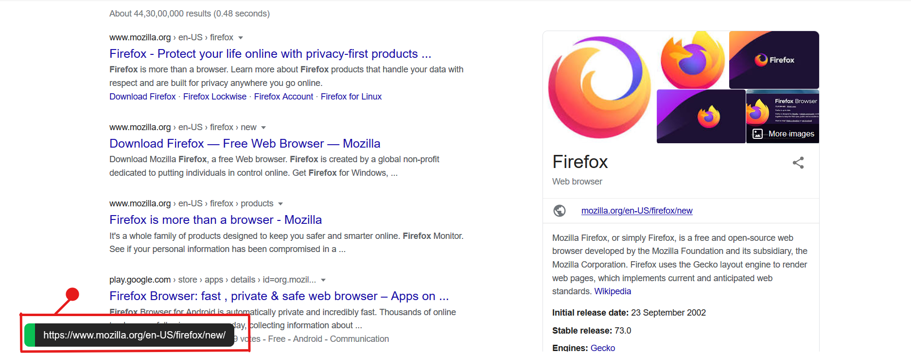

# anchor-view

Show a popup with anchor links unless told not to.

A very simple extension it will just the link that you hover on as a popup.
To do that it takes the anchor tag and when you take your cursor on it, the url that it points to is captures and showed to you as a popup.

Demo Image :  

Download the extension :  
 * [For firefox](https://addons.mozilla.org/en-US/firefox/addon/anchor-view/) 
